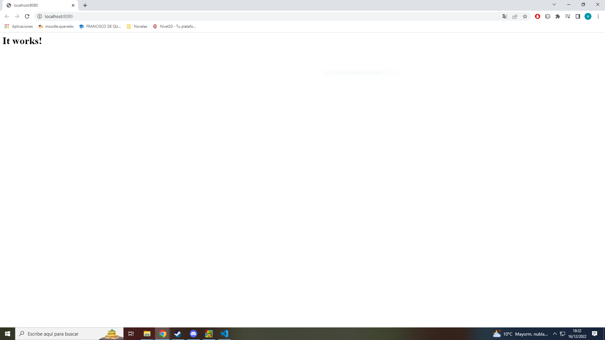

# P05 - Despliegue de aplicaciones web con docker compose

## Autores ✒️

- Alberto Jiménez Guidiño
- Alfonso Fco Gismera Perea

## Pre-requisitos 📋

Lógicamente necesitamos Docker Desktop y V.Scode.
Tendremos una principal y dentro de esta una para cada uno de los ejemplos.

## Wiki 📖

Los apuntes de la profesora y tambien las páginas
https://hub.docker.com/_/mediawiki
https://josedom24.github.io/curso_docker_2022/sesion4/docker-compose.html

# Instalación 🔧

Creamos un archivo.yml y lo metemos en sus respectivas carpetas y luego usamos el comando docker-compose up -d

## 1.Servidor Apache🔧

version: '3.9'
services:
apache:
image: httpd:latest
container_name: mi-servidor-apache
ports: - '8080:80'
volumes: - C:/html:/var/www/html

### Pruebas Apache ⚙️

---

### 2.WordPress🔧

En el docker-compose.yml volvemos a poner la version en este caso 3.1,
wordpress:
image: wordpress
restart: always
ports: - 8080:80
environment:
WORDPRESS_DB_HOST: db
WORDPRESS_DB_USER: alberto
WORDPRESS_DB_PASSWORD: 123456
WORDPRESS_DB_NAME: albertodb
volumes: - wordpress:/var/www/html

db:
image: mysql:5.7
restart: always
environment:
MYSQL_DATABASE: albertodb
MYSQL_USER: alberto
MYSQL_PASSWORD: 123456
MYSQL_RANDOM_ROOT_PASSWORD: '1'
volumes: - db:/var/lib/mysql

volumes:
wordpress:
db:

### Pruebas WordPress ⚙️

---

## 3. Mediawiki🔧

En el docker-compose.yml volvemos a poner la version en este caso 3.1
services:
mediawiki:
image: mediawiki
container_name: miawiki
restart: always
ports: - 8080:80
links: - database
volumes: - images:/var/www/html/images
database:
image: mariadb
restart: always
environment:
MYSQL_DATABASE: miwiki
MYSQL_USER: alberto
MYSQL_PASSWORD: 123456
MYSQL_RANDOM_ROOT_PASSWORD: 'yes'
volumes: - db:/var/lib/mysql

volumes:
images:
db:
Luego de iniciar los contenedores lo abrimos en browser y seguimos los pasos para descargar Localsettings y los copiamos a (nombre de conternedor):/var/www/html

### Pruebas Medíawiki ⚙️

---

## 4.Adminer🔧

version: '3.1'

services:

adminer:
image: adminer
restart: always
ports: - 8080:8080

db:
image: mysql:5.6
restart: always
environment:
MYSQL_ROOT_PASSWORD: 123456

### Pruebas Adminer ⚙️

---

## 5.Guestbook🔧

version: '3.1'
services:
app:
container_name: guestbook
image: iesgn/guestbook
restart: always
ports: - 80:5000
db:
container_name: redis
image: redis
restart: always

### Pruebas Guestbook ⚙️

---
